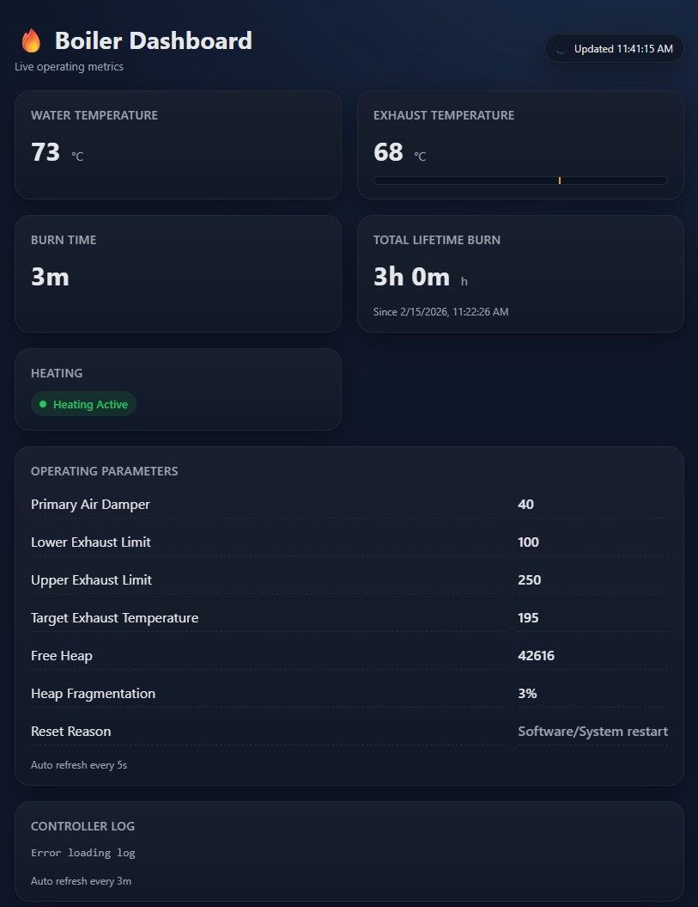

# Wood burning boiler (Vedpanna)

A small Arduino project running on ESP8266 nodemcu to power my boiler.

Uses one MAX6675 temperature sensor for the water temperature, and another one for the exhaust temperature.

This controls a relay which powers the exhaust fan and air inlet into the room. Exhaust fan is stopped once the boiler has stopped burning, and air inlet to room is closed.

How hot the boiler burns is controlled with a homebrewed PID, which controls a step-motor on the primary air inled into the boiler.

Information is displayed on a 128 x 64 pixel SH1106 OLED display, as well as a remotely available vibe-coded web GUI.

